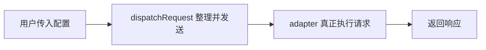
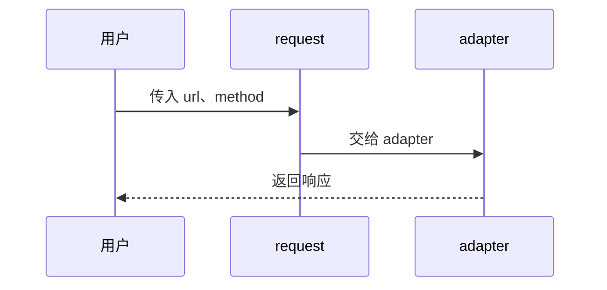
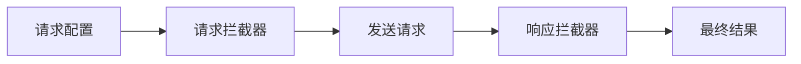

# ts-axios

这个项目不是为了做一个完整替代 axios 的库，而是为了用 TypeScript 一步步拆开 axios 的核心思路。

如果你直接去看成熟的 axios，会同时遇到实例、拦截器、配置合并、数据转换、错误处理、取消请求等很多概念，很容易不知道先看哪一层。这个仓库把这些能力拆成 10 个 Git 提交，每个提交只解决一个主要问题。

你可以按提交历史从最早的提交开始看：

```bash
git log --oneline --reverse
```

## 学习路线

| 步骤 | 主要问题 | 引入的能力 |
| --- | --- | --- |
| Step 1 | 怎么把一个配置变成一次请求 | 最小请求流程 |
| Step 2 | 只暴露 request 太难用 | axios 实例和 get/post 等快捷方法 |
| Step 3 | 地址参数和请求头会重复手写 | 参数拼接和请求头整理 |
| Step 4 | 返回 404/500 时不应该还当成功 | 成功和失败的分界线 |
| Step 5 | 普通 Error 信息太少 | 更完整的请求错误 |
| Step 6 | 响应数据类型太模糊 | 泛型响应结果 |
| Step 7 | 每个请求前后都想统一处理 | 请求和响应拦截器 |
| Step 8 | 公共配置重复写 | 默认配置和创建实例 |
| Step 9 | 请求体、响应体需要自动转换 | 数据转换 |
| Step 10 | 请求不需要了要能停掉 | 取消请求和小工具 |

## 整体流程

最小版本里，流程只有三段：



后面逐步完善之后，它会变成这样：


## Step 1：最小请求流程

一开始只做最小的事情：

```ts
request({
  url: '/users',
  method: 'GET'
})
```

它解决的是最核心的问题：用户给一个配置，库负责返回一个 Promise。

> 为什么不一开始就做完整 axios？

反例是：如果第一步就把实例、拦截器、配置合并全部放进来，读者会分不清“真正发送请求”的那条主线在哪里。

所以第一步只保留主线：



## Step 2：axios 实例和快捷方法

只有 `request(config)` 可以用，但用起来不像平时熟悉的 axios。

于是补上：

```ts
axios('/users')
axios.get('/users')
axios.post('/articles', { title: 'hello' })
```

> 为什么不让用户一直写 request？

反例是：一个项目里几十个 GET 请求，如果每次都写：

```ts
request({
  url: '/users',
  method: 'GET'
})
```

代码会重复，而且读起来不够直接。`get`、`post` 这些方法让“我要做什么”更明显。

## Step 3：参数和请求头整理

真实请求里经常会写查询参数：

```ts
axios.get('/users', {
  params: {
    page: 1,
    role: 'admin'
  }
})
```

最后应该变成：

```text
/users?page=1&role=admin
```

请求头也有类似问题：

```ts
{
  accept: 'application/json',
  Accept: 'text/plain'
}
```

它们表达的是同一个头，不能保留成两份。

> 为什么要在库里处理这些小事？

反例是：如果每个业务请求都自己拼字符串，很容易漏掉编码、空值、数组、已有问号等细节。库统一处理，业务代码就能只关心“我要传什么”。

## Step 4：判断成功和失败

请求发出去了，不代表业务上成功了。

比如服务端返回 `404`：

```ts
axios.get('/missing')
```

这时 Promise 应该进入失败分支，而不是还当成成功结果继续往下走。

> 为什么不能只要服务器有响应就 resolve？

反例是：页面请求用户资料，接口返回 `500`，如果仍然进入成功分支，后面的代码可能继续拿错误内容当正常数据用，问题会更隐蔽。

所以这里引入 `validateStatus`：

```ts
axios.get('/missing', {
  validateStatus: status => status === 404
})
```

默认情况下，只有 `200` 到 `299` 被认为是成功。

## Step 5：更完整的错误

普通 `Error` 只能告诉你一句话，比如：

```text
Request failed with status code 500
```

但调试时你通常还想知道：

| 需要知道什么 | 为什么重要 |
| --- | --- |
| 请求配置 | 知道当时请求了哪个地址、用了什么参数 |
| 状态码 | 知道是服务端错误、权限错误还是地址错误 |
| 响应内容 | 知道服务端具体返回了什么 |
| 错误类型 | 知道它是不是这个库产生的错误 |

> 为什么不直接抛原始错误？

反例是：网络错误、状态码错误、取消请求都可能走失败分支。如果没有统一的错误形状，业务代码就要写很多猜测逻辑。

所以这里引入 `AxiosError` 和 `isAxiosError`。

## Step 6：响应数据类型

请求成功之后，最重要的是 `response.data`。

如果它一直是模糊类型，使用者就不知道里面有什么：

```ts
const response = await axios.get('/me')
response.data.name
```

这里读起来像是能用，但类型层面并不知道 `name` 是否存在。

> 为什么要让调用方写类型？

反例是：用户接口返回 `{ name: string }`，文章接口返回 `{ title: string }`，库本身不可能提前知道每个接口的数据结构。最清楚的人是调用方。

所以可以这样写：

```ts
interface UserProfile {
  name: string
  role: string
}

const response = await axios.get<UserProfile>('/me')
response.data.name
```

## Step 7：拦截器

很多逻辑不是某一个接口独有，而是所有请求都需要。

比如请求发出前统一加 token：

```ts
axios.interceptors.request.use(config => {
  return {
    ...config,
    headers: {
      ...config.headers,
      Authorization: 'Bearer token'
    }
  }
})
```

比如响应回来后统一取出某一层数据：

```ts
axios.interceptors.response.use(response => {
  return response
})
```

> 为什么不在每个接口里手写？

反例是：有 50 个接口都要带 token，如果每个地方手写一次，后面改 token 规则时就要找 50 个地方。

拦截器像是在请求前后各放一个处理站：



这和 mini-koa 里的“包一层再继续走”很像，只是这里包的是一次 HTTP 请求。

## Step 8：默认配置和创建实例

一个项目通常有公共地址：

```text
https://api.example.com/v1
```

也有公共请求头：

```text
Accept: application/json
```

如果每个请求都写一遍，会很重复。

所以可以创建一个实例：

```ts
const api = axios.create({
  baseURL: 'https://api.example.com/v1',
  headers: {
    Accept: 'application/json'
  }
})

api.get('/users')
```

> 为什么要创建实例，而不是只改全局 axios？

反例是：一个页面同时请求“用户系统”和“支付系统”，它们的基础地址和头信息可能完全不同。如果只有全局配置，两个系统就会互相影响。

实例可以隔离不同的请求环境。

## Step 9：请求和响应数据转换

业务里常写：

```ts
axios.post('/articles', {
  title: 'hello'
})
```

但真正发出去时，对象需要变成 JSON 字符串。

响应回来时，服务端也经常返回 JSON 字符串，使用时希望它已经变成对象。

> 为什么不让使用者自己 JSON.stringify 和 JSON.parse？

反例是：如果每个地方都自己转，请求代码会变得很吵，而且容易出现有些接口转了、有些接口忘了转的情况。

所以这里加入默认转换：

| 方向 | 默认处理 |
| --- | --- |
| 请求发出前 | 普通对象转 JSON 字符串 |
| 响应回来后 | JSON 字符串转对象 |

也可以自己传转换函数：

```ts
axios.post('/custom', 'hello', {
  transformRequest: data => `${data} world`,
  transformResponse: data => `${data}!`
})
```

## Step 10：取消请求和辅助方法

有些请求已经不需要了，比如用户快速切换页面，旧页面的请求还没回来。这时继续处理旧结果，可能会覆盖新页面的数据。

所以加入 `AbortController`：

```ts
const controller = new AbortController()

axios.get('/users', {
  signal: controller.signal
})

controller.abort()
```

> 为什么取消请求也是核心能力？

反例是：搜索框输入 `a`、`ab`、`abc`，如果三个请求都发出去了，最慢返回的那个旧请求可能最后覆盖最新结果。

最后还补了几个小工具：

```ts
import { all, spread, isCancel } from 'ts-axios'
```

它们不是主线，但能让这个学习版更接近日常使用。

## 最终能力

现在这个 mini 版本已经覆盖 axios 最核心的学习点：

- 请求配置
- 请求实例
- 快捷方法
- 参数拼接
- 请求头整理
- 成功和失败判断
- 错误对象
- 响应数据类型
- 请求拦截器
- 响应拦截器
- 默认配置
- 创建实例
- 请求数据转换
- 响应数据转换
- 取消请求

这不是完整 axios，但已经足够帮助你理解 axios 为什么会长成现在这样。

## 本地验证

```bash
npm install
npm test
npm run typecheck
npm run build
```

如果这三条都通过，说明当前学习版的主要功能是正常的。
